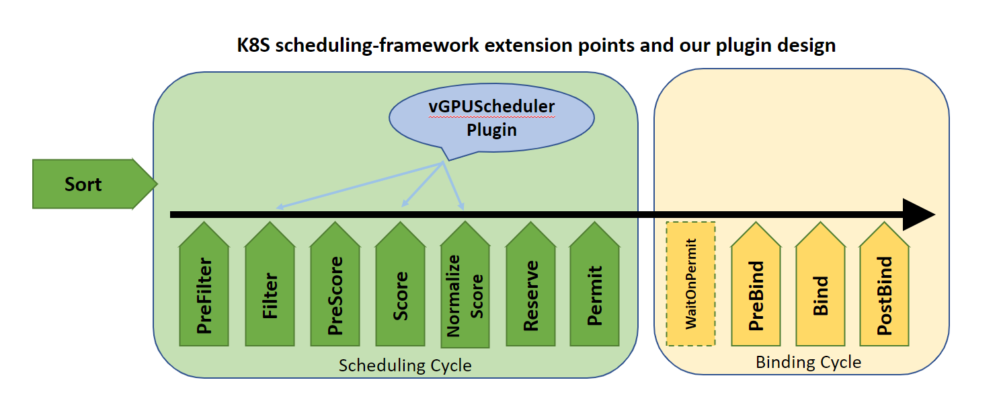

# vGPUScheduler: A customized scheduler for virtual GPUs 

vGPUScheduler is a customized kubernetes scheduler based on [scheduling-framework](https://github.com/kubernetes/enhancements/blob/master/keps/sig-scheduling/20180409-scheduling-framework.md). The APIs of scheduling framework allow most scheduling features to be implemented as plugins, while keeping the scheduling core more maintainable. As shown in the diagram, the framework defines a few extension points in both the scheduling cycle and the binding cycle. Our design of plugins are registered and invoked at the Filter and Score extension points to change the scheduling decisions, respectively. 

#### Diagram of K8S scheduling-framework and our design


#### Get Started
- Make sure kubernetes cluster version is 1.17+, otherwise it may not fully support the K8S scheduling-framework
- Git clone the alnair Repo:
```shell
git clone git@github.com:CentaurusInfra/alnair.git
```
- In the vGPUScheduler folder, compile:
```shell
make local
```
- Build the docker image, and push to your docker hub:
```shell
make build
make push
make clean
```
- Backup your `kube-scheduler.yaml` usually located in `/etc/kubernetes/manifests/`. Then copy our `deploy/kube-scheduler.yaml` and `deploy/vGPUScheduler-config.yaml` to `/etc/kubernetes/manifests/`. Change the image link in `kube-scheduler.yaml` accordingly.
- Check if the new scheduler is running in your cluster:
```shell
kubectl get pod -n kube-system | grep "scheduler"
```
#### Deploy a Pod using vGPUScheduler
- Create a pod which needs 4GB GPU memory
```shell
kubectl create -f pod.yaml
```
- Then create a pot which needs 10G GPU memory
```shell
kubectl create -f pod2.yaml
```
- Check the pods status and see which node and GPU they were bound to via the pod annotations. 
```shell
kubectl get pod gpu-pod -o yaml | grep -A 8 annotations
```
