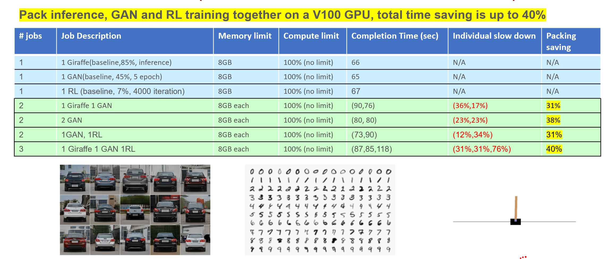

# Alnair GPU sharing feature demo
## Purpose
Demostrate running multiple jobs on one GPU, i.e., GPU sharing feature, provided by Alnair platform improves GPU utilization and reduce overall job completion time.

Alnair vGPU device plugin supports both fractional gpu memory and compute to indiviual job/process, together with vGPU scheduler gurantees no cross-node scheduling.  
## Prerequisite
A two-node Kubernetes cluster. At least one node has one Nvidia GPU card.

## Steps
The following steps were executed and verified on a v1.21.4 Kubernetes cluster. Nvidia GPU is V100 with 32GB RAM.

1. Clone Alnair Git repo

    ```git clone https://github.com/CentaurusInfra/alnair.git```

2. Install Alnair vGPU device plugin (for GPU sharing)

    ```kubectl apply -f alnair/alnair-device-plugin/manifests/alnair-device-plugin.yaml```

3. Install Alnair scheduler (for alnair-vgpu resource scheduling)

    ```sudo alnair/autonomous-scheduler/vGPUScheduler/install.sh```

4. Install Alnair profiler (for GPU utilization visualization)

    ```kubectl apply -f alnair/alnair-profiler/profiler-all-in-one.yaml```

5. Launch jobs sequentially, record each job’s completion time (without sharing)

    ```
    kubectl apply -f alnair/demo/gpu-sharing/ai-jobs/giraffe-demo.yaml
    # wait after the pod is completed, roughly 1 minute
    kubectl apply -f alnair/demo/gpu-sharing/ai-jobs/gan-mnist-demo.yaml
    ```

7. Launch jobs at the same time on the same job, record each job’s completion time (with GPU sharing)

    ``` kubectl apply -f alnair/demo/gpu-sharing/ai-jobs/giraffe-demo.yaml && kubectl apply -f alnair/demo/gpu-sharing/ai-jobs/gan-mnist-demo.yaml```

8. Compare GPU utilization, and Job completion time

## Results 


