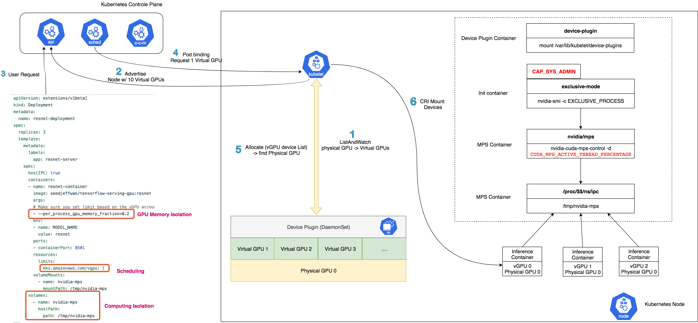

# Virtual GPU device plugin for Kubernetes

The virtual device plugin for Kubernetes is a Daemonset that allows you to automatically:
- Expose arbitrary number of virtual GPUs on GPU nodes of your cluster.
- Run ML serving containers backed by Accelerator with low latency and low cost in your Kubernetes cluster.

This repository contains AWS virtual GPU implementation of the [Kubernetes device plugin](https://github.com/kubernetes/community/blob/master/contributors/design-proposals/resource-management/device-plugin.md).

## Prerequisites

The list of prerequisites for running the virtual device plugin is described below:
* NVIDIA drivers ~= 361.93
* nvidia-docker version > 2.0 (see how to [install](https://github.com/NVIDIA/nvidia-docker) and it's [prerequisites](https://github.com/nvidia/nvidia-docker/wiki/Installation-\(version-2.0\)#prerequisites))
* docker configured with nvidia as the [default runtime](https://github.com/NVIDIA/nvidia-docker/wiki/Advanced-topics#default-runtime).
* Kubernetes version >= 1.10
* **Nvidia GPU architecture >=7.0 (Volta) e.g. it won't work on TitanX GPU**
## High Level Design


## Quick Start

### Label GPU node groups

```bash
kubectl label node <your_k8s_node_name> k8s.amazonaws.com/accelerator=vgpu
```

### Enabling virtual GPU Support in Kubernetes

Update node selector label in the manifest file to match with labels of your GPU node group, then apply it to Kubernetes.

```shell
apiVersion: apps/v1
kind: DaemonSet
metadata:
  name: aws-virtual-gpu-device-plugin-daemonset
  namespace: kube-system
spec:
  selector:
    matchLabels:
      name: aws-virtual-gpu-device-plugin
  updateStrategy:
    type: RollingUpdate
  template:
    metadata:
      # This annotation is deprecated. Kept here for backward compatibility
      # See https://kubernetes.io/docs/tasks/administer-cluster/guaranteed-scheduling-critical-addon-pods/
      annotations:
        scheduler.alpha.kubernetes.io/critical-pod: ""
      labels:
        name: aws-virtual-gpu-device-plugin
    spec:
      hostIPC: true
      nodeSelector:
        k8s.amazonaws.com/accelerator: vgpu
      tolerations:
      # This toleration is deprecated. Kept here for backward compatibility
      # See https://kubernetes.io/docs/tasks/administer-cluster/guaranteed-scheduling-critical-addon-pods/
      - key: CriticalAddonsOnly
        operator: Exists
      - key: k8s.amazonaws.com/vgpu
        operator: Exists
        effect: NoSchedule
      # Mark this pod as a critical add-on; when enabled, the critical add-on
      # scheduler reserves resources for critical add-on pods so that they can
      # be rescheduled after a failure.
      # See https://kubernetes.io/docs/tasks/administer-cluster/guaranteed-scheduling-critical-addon-pods/
      priorityClassName: "system-node-critical"
      # In case machine deploy MPS device plugin and change compute mode to
      initContainers:
      - name: set-compute-mode
        image: nvidia/cuda:11.4.0-base-ubuntu18.04
        command: ['nvidia-smi', '-c', 'EXCLUSIVE_PROCESS']
        securityContext:
          capabilities:
            add: ["SYS_ADMIN"]
      containers:
      - image: amazon/aws-virtual-gpu-device-plugin:v0.1.0
        name: aws-virtual-gpu-device-plugin-ctr
        securityContext:
          allowPrivilegeEscalation: false
          capabilities:
            drop: ["ALL"]
        volumeMounts:
        - name: device-plugin
          mountPath: /var/lib/kubelet/device-plugins
      - image: nvidia/mps
        name: mps
        volumeMounts:
        - name: nvidia-mps
          mountPath: /tmp/nvidia-mps
        env:
        - name: CUDA_MPS_ACTIVE_THREAD_PERCENTAGE
          value: "10"
      volumes:
      - name: device-plugin
        hostPath:
          path: /var/lib/kubelet/device-plugins
      - name: nvidia-mps
        hostPath:
          path: /tmp/nvidia-mps
```

### Running GPU Jobs

Virtual NVIDIA GPUs can now be consumed via container level resource requirements using the resource name `k8s.amazonaws.com/vgpu`:

```yaml
apiVersion: apps/v1
kind: Deployment
metadata:
  name: resnet-deployment
spec:
  replicas: 3
  selector:
    matchLabels:
      app: resnet-server
  template:
    metadata:
      labels:
        app: resnet-server
    spec:
      # hostIPC is required for MPS communication
      hostIPC: true
      containers:
      - name: resnet-container
        image: seedjeffwan/tensorflow-serving-gpu:resnet
        args:
        # Make sure you set limit based on the vGPU account to avoid tf-serving process occupy all the gpu memory
        - --per_process_gpu_memory_fraction=0.2
        env:
        - name: MODEL_NAME
          value: resnet
        ports:
        - containerPort: 8501
        # Use virtual gpu resource here
        resources:
          limits:
            k8s.amazonaws.com/vgpu: 1
        volumeMounts:
        - name: nvidia-mps
          mountPath: /tmp/nvidia-mps
      volumes:
      - name: nvidia-mps
        hostPath:
          path: /tmp/nvidia-mps
---
apiVersion: v1
kind: Service
metadata:
  labels:
    run: resnet-service
  name: resnet-service
spec:
  ports:
  - port: 8501
    targetPort: 8501
  selector:
    app: resnet-server
  type: ClusterIP
```

## Reference
[Virtual GPU device plugin for Kubernetes](https://github.com/awslabs/aws-virtual-gpu-device-plugin)
