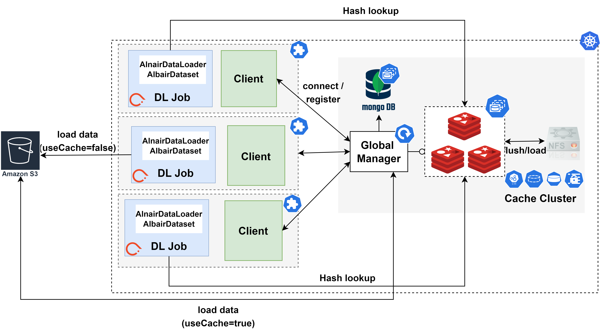

# K-V-Store

This project aims to develop a K8s-based storaging caching system for speeding up big data-driven Deep Leaning training and inference jobs.

## System Architecture and Main Components
- Global Manager (GM): acts as the core of the cache cluster. Specifically, it
    - handles Connection, Job Registration, Heartbeat and Cache Missing requests from Client
    - interacts with MongoDB servers to manipulate client and job meta information
    - pulls data from S3 to Redis Cluster
    - performs data persistence by periodically flushing data into NFS storage
- AlnairPod: is a [CRD](./alnairpod-operator) resource associated with a ConfigMap and a Pod, in which the latter hosts a Client container and a DLJob container.
    - Client Container: communicates with GM and share data location in Redis with DLJob. This container is automatically created when deploying an AlnairPod, and act as a daemon process of bridging DLJobs and Cache Cluster.
    - DLJob Container: is the container where DL training or inference jobs are running. Users are required to inherent our [AlnairJobDataset](./examples/lib/AlnairJobDataset.py) class and initialize the [AlnairJobDataLoader](./examples/lib/AlnairJobDataLoader.py) class, as what they do when defining Pytorch custom Dataset.
- Redis Cluster: is a key-value caching system deployed as a K8s StatefulSet.
    - Content hashing is executed when generating keys. 
    - When data eviction is enabled, GM automatically dumps data that are likely to be evicted into NFS. 
    - Redis Cluster supports two working modes: direct mode and proxy mode, handling cases in that clients are from the same or different K8s cluster than the Cache Cluster, respectively.
- HA MongoDB: is a MongoDB server cluster deployed as a K8s StatefulSet. The database contains a [Client](./src/manager/mongo-schemas/client.json) and a [Job](./src/manager/mongo-schemas/job.json) collections.



## Cache Cluster Setup
### Step 1. Redis Statefulset (3 replicas)
Redis configurations are saved in [config.yaml](./cache-cluster/cacher/Redis/cluster/config.yaml). Please change and remember the `masterauth` and `requirepass` fields and uncomment the `bind=0.0.0.0`. For data eviction, consider to configure `maxmemory-policy`, `maxmemory` and `maxmemory-samples`. To run more instances, change the `replicas` field in the [cluster.yaml]((./cache-cluster/cacher/Redis/cluster/cluster.yaml)) file.

Edit the [secret.yaml](cache-cluster/cacher/Redis/cluster/secret.yaml) to set passwords. Then execute:

```bash
cd cache-cluster/cacher/Redis/cluster
sh setup.sh init # enter `yes` when you see the prompt
```

If clients are from a different K8s cluster than the Cache Cluster, please set the `enable_proxy` knob to true in the [config.yaml](./cache-cluster/manager/configmap.yaml). This will enable the envoy-proxy mode. Then, execute:
```bash
kubectl apply -f envoy-proxy-config.yaml
kubectl apply -f envoy-proxy-deploy.yaml
```
Envoy-proxy service is exposed through NodePort with targetPort 30001. To get the node IP envoy-proxy is using:
```bash
kubectl get pods -o wide | grep envoy-proxy | awk '{ print $7 }'
```

### Step 2. HA MongoDB Statefulset
```bash
# please ensure you create diectory /mnt/data on all nodes
cd cache-cluster/cacher/mongodb
sh setup.sh init

# execute the follwing commands in the mongodb console:
rs.initiate()
var cfg = rs.conf()
cfg.members[0].host="mongo-0.mongo:27017"
rs.reconfig(cfg)
rs.add("mongo-1.mongo:27017")
rs.status()
db.createUser(
{
    user: "alnair",
    pwd: "alnair",
    roles: [
            { role: "userAdminAnyDatabase", db: "admin" },
            { role: "readWriteAnyDatabase", db: "admin" },
            { role: "dbAdminAnyDatabase", db: "admin" },
            { role: "clusterAdmin", db: "admin" }
        ]
})
exit()

# get the Cluser-IP and targetPort of mongodb service
kubectl get svc mongo
```

<<<<<<< HEAD
### Step 3. Global Manager (GM) Deployment
=======
### Step 3. Deploy Global Manager (GM) Deployment
>>>>>>> f7d4072fc5cb76d23941e54be8676db927d3394d
Edit the [configmap.yaml](cache-cluster/manager/configmap.yaml) to define configurations of the manager, mongodb, and redis_proxy. To enable data persistence, execute [nfs.sh](cache-cluster/manager/nfs.sh) to set up NFS server on all worker nodes. Then execute:
```bash
cd cache-cluster/manager/
kubectl apply -f .
```
### Step 4. AlnairPod CRD
Follow the [README](./alnairpod-operator/README.md) file to deploy AlnairPod operator and run its controller in your cluster.

## AlnairPod Development and Deployment
The below shows an example of the definition of an ImageNet AlnairPod.
```yaml
apiVersion: alnair.com/v1alpha1
kind: AlnairPod
metadata:
  name: imagenet
  namespace: default
spec:
  secret:
    name: alnairpod-client-secret
  jobs: # all fields supported by a regular Pod container are supported here.
  - name: job
    image: <your repository>/imagenet:latest
    command: ["python3", "main.py"]
    datasource: # required field
      name: ImageNet-Mini
      bucket: <your s3 bucket name>
      keys:
      - imagenet-mini/train
      - imagenet-mini/val
    configurations:
      usecache: true
      maxmemory: 0  # unlimited memory
      durabilityindisk: 1440
    tty: true
    stdin: true
```
